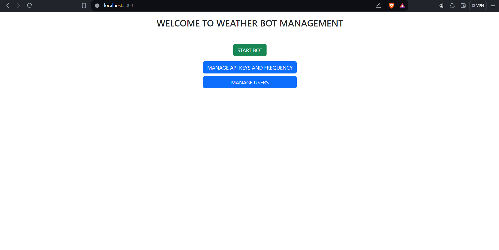
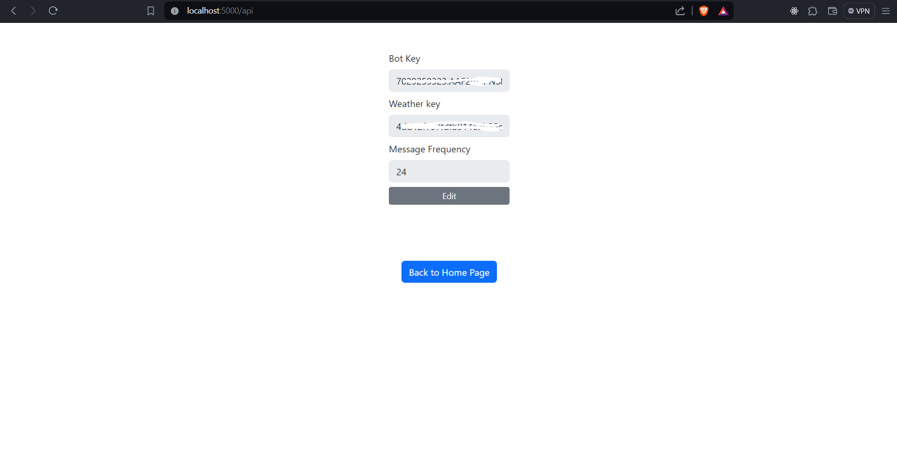
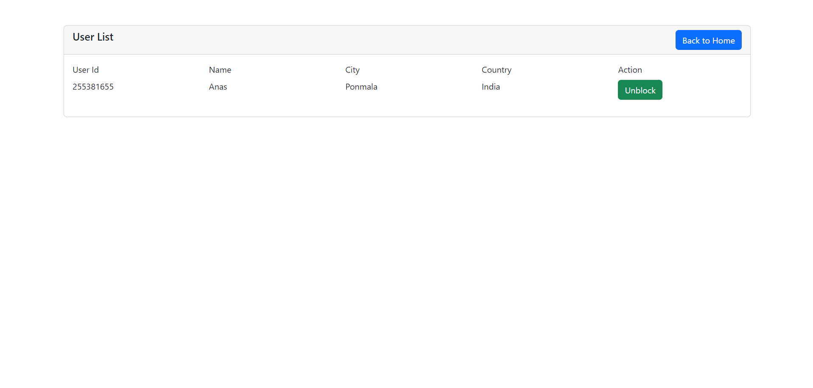

# Weather Telegram Bot

WeatherBot is a Telegram bot built using Node.js and MongoDB that provides users with daily weather updates based on their location. The bot is designed for users who want to receive personalized and regular weather information in a convenient manner through the Telegram messaging platform.

## Tech Stack

**Client:** express-handlebars, bootstrap, Ajax, SweetAlert

**Server:** Node, Express, axios, node-schedule, node-telegram-bot-api, nodemon, mongoose, dotenv, country-list

## Functionality

#### 1. User Registration:

- The bot welcomes first-time users and prompts - them to provide their name, city, and country.
- The user information is stored in a MongoDB collection for future reference.

#### 2. Daily Weather Updates:

- Users receive daily weather updates tailored to their specified city and country.
- The bot utilizes a weather API to fetch and send relevant weather information.

#### 3. Admin Panel:

- An admin panel is available for managing key aspects of the bot.
- Admins have the ability to initiate or halt the bot's operations.
- Admins can update API keys for weather information, adjust message frequency for weather updates, and block users.

## Screenshots





## Setup

#### 1. Clone the Repository:

```bash
 https://github.com/anasmullappally/weather_bot.git
```

#### 2. Install Dependencies:

```bash
cd weather_bot
npm install
```

#### 3.Configure Environment Variables:

Create a `.env` file in the root directory and set the following variables:

```bash
PORT=3000
MONGO_URI=your_mongo_connection_uri
```

Replace your_mongo_connection_uri with the actual MongoDB connection URI you intend to use. Additionally, specify the PORT on which you want the application to run.

#### 3.Run Project

To run the project, use the following command:

```bash
npm start
```

## Routes

#### 1. `GET` / - Home Page

**Description:**  
Renders the home page of the WeatherBot admin interface.

**Request:**

- Method: `GET`
- URL: `/`

**Response:**

- Status Code: `200 OK`
  - Body:
    ```json
    {
      "pageTitle": "Home",
      "isBotRunning": true
    }
    ```
- Status Code: `500 Internal Server Error`
  - Body:
    ```json
    { "pageTitle": "Internal Server Error" }
    ```

#### 2. `POST` /start-bot - Start Bot

**Description:**
Starts the WeatherBot polling with the provided API keys.

**Request:**

- Method: `POST`
- URL: `/start-bot`
- Headers: None
- Body: None

**Response:**

- Status Code: `200 OK`
  - Body:
    ```json
    { "message": "Bot started successfully." }
    ```
- Status Code: `400 Bad Request`
  - Body:
    ```json
    { "message": "Please add the necessary API key before proceeding." }
    ```
- Status Code: `500 Internal Server Error`
  - Body:
    ```json
    { "message": "Internal Server Error" }
    ```

#### 3. `POST` /stop-bot - Stop Bot

**Description:**
Stops the currently running WeatherBot polling.

**Request:**

- Method: `POST`
- URL: `/stop-bot`
- Headers: None
- Body: None

**Response:**

- Status Code: `200 OK`
  - Body:
    ```json
    { "message": "Bot has been successfully stopped." }
    ```
- Status Code: `500 Internal Server Error`
  - Body:
    ```json
    { "message": "Internal Server Error" }
    ```

#### 4. `GET` /api - API Page

**Description:**
Renders the API page of the WeatherBot admin interface.

**Request:**

- Method: `GET`
- URL: `/api`

**Response:**

- Status Code: `200 OK`
  - Body:
    ```json
    {
      "apiKey": {
        "telegram": "your_telegram_api_key",
        "weather": "your_weather_api_key",
        "frequency": 60
      }
    }
    ```
- Status Code: `500 Internal Server Error`
  - Body:
    ```json
    { "pageTitle": "Internal Server Error" }
    ```

#### 5. `POST` /api - Add API Keys

**Description:**
Adds new API keys for Telegram bot and Weather and set the message frequency.

**Request:**
 - Method: `POST`
 - URL: `/api`
 - Headers:
  - Content-Type: application/json
 - Body:
  ```json
  {
    "botApi": "your_telegram_api_key",
    "weatherApi": "your_weather_api_key",
    "frequency": 60
  }

  ```
**Response:**

- Status Code: `200 OK`
  - Body:
    ```json
    { "message": "API Keys added successfully" }
    ```
- Status Code: `400 Bad Request`
  - Body:
    ```json
    { "message": "Please provide the Telegram bot API key." }
    ```

### 6. `PUT` /api - Update API Keys

**Description:**
Updates existing API keys and restarts the bot with new keys.

**Request:**

- Method: `PUT`
- URL: `/api`
- Headers:
  - Content-Type: application/json
- Body:
  ```json
  {
    "botApi": "your_telegram_api_key",
    "weatherApi": "your_weather_api_key",
    "frequency": 60
  }
  ```
  **Response:**
- Status Code: `200 OK`
  - Body:
    ```json
    { "message": "API keys updated successfully, and bot started." }
    ```
- Status Code: `400 Bad Request`
  - Body:
    ```json
    { "message": "Please provide the Telegram bot API key." }
    ```
- Status Code: `500 Internal Server Error`
  - Body:
    ```json
    { "pageTitle": "Internal Server Error" }
    ```

#### 7. `GET` /users - Users Management Page

**Description:**  
Retrieves a list of users for display in the admin interface.

**Request:**

- Method: `GET`
- URL: `/users`

**Response:**

- Status Code: `200 OK`
  - Body:
    ```json
    {
      "pageTitle": "users",
      "users": [
        {
          "userId": 1,
          "name": "User1",
          "city": "City1",
          "country": "Country1"
        },
        { "userId": 2, "name": "User2", "city": "City1", "country": "Country2" }
      ]
    }
    ```
- Status Code: `500 Internal Server Error`
  - Body:
    ```json
    { "pageTitle": "Internal Server Error" }
    ```

#### 8. `PUT` /users/toggle-block - Toggle User Block Status

**Description:**  
Toggles the block status of a user.

**Request:**

- Method: `PUT`
- URL: `/users/toggle-block`
- Headers:
  - Content-Type: application/json
- Body:
  ```json
  {
  "userId" : 1,
  "action" :"block"
  }
  ```

**Response:**
  - Status Code: `200 OK`
  - Body:
    ```json
    { "message": "User blocked/unblocked successfully." }
    ```
- Status Code: `500 Internal Server Error`
  - Body:
    ```json
    { "pageTitle": "Internal Server Error" }
    ```

## License

[MIT](https://choosealicense.com/licenses/mit/)
